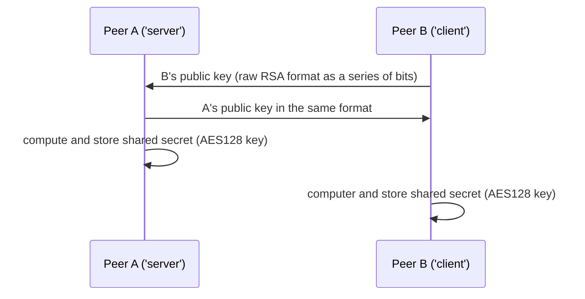
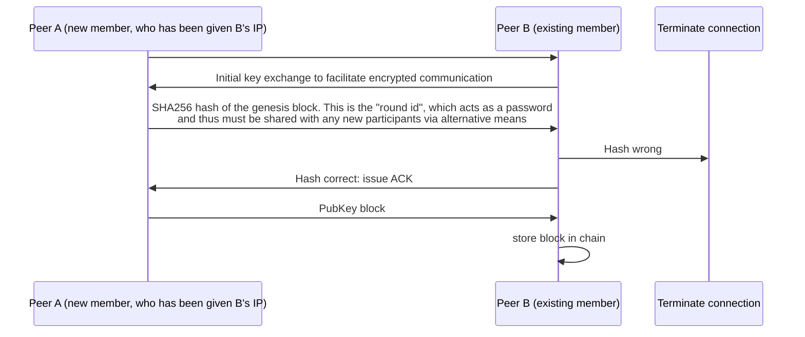
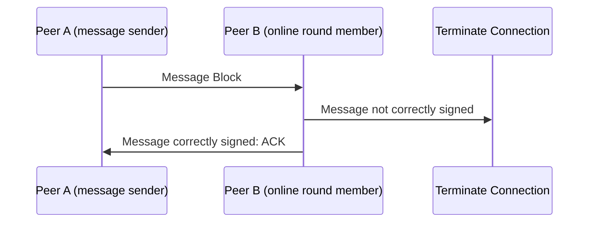
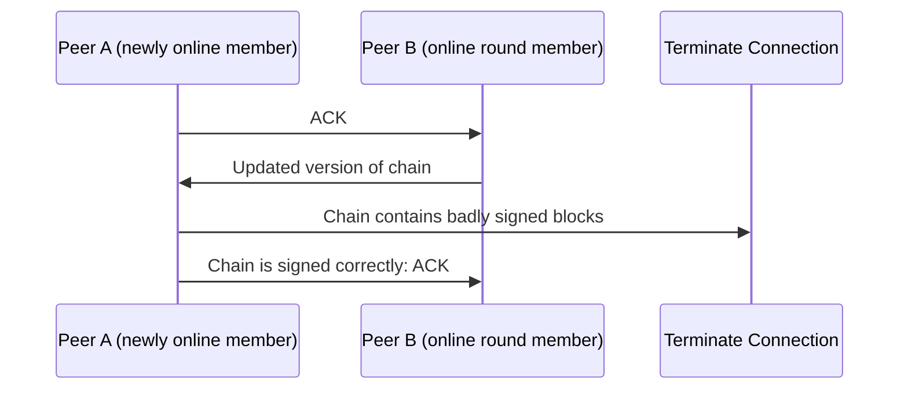

# opentalk
> a decentralized chat application

## Idea
- a fully P2P chat app
- no central server
- no third-party P2P libraries, relying solely on Unix sockets
- fully public/private encrypted

## Organization
- the project is based around "rounds", which are lists of peers that are connected to each other
- when a peer wants to send a message, they send it to all other peers in the round 
- if none are online, the message is stored until one is

## Example Usage
- Peer A wishes to send a message
- If no peers are online (responding to pings), the message is stored until one is
- now 1+ peers are online, Peer A first requests their working version of the round blockchain
- Peer A then verifies each of the peers' versions of the round blockchain
- Now they have an updated version of the round blockchain, their block is tacked on to the end and sent to all online peers
- all online peers verify that all new blocks are correctly signed (all peers, at first connection, exchange public keys by sending a Pubkey block)
- if Peer B is satisfied that all new blocks are correctly signed, they add the new block to their version of the round blockchain

## todo

## protocol examples
### Diffie-Hellman Key Exchange

### Initial PubKey block issued

### Send new message
- the below exchange is replicated with all online peers

### Catch peer "up to speed"
- all online peers should have this exchange

## todo
- implement rounds